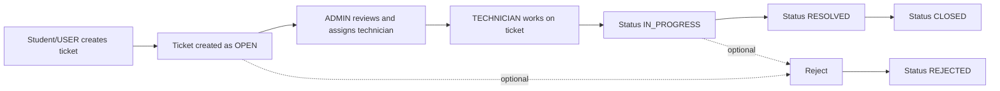

# Smart Campus Operations Hub

<div align="center">


</div>

## Overview

Smart Campus Operations Hub is a full-stack university operations platform designed to centralize day-to-day campus workflows. This repository delivers the **Incident & Maintenance Ticketing module (Module C)** while fitting into the larger smart-campus ecosystem.

The system supports efficient reporting, triaging, technician assignment, status progression, and collaboration through comments and attachments.

## Why This Project

- Centralize campus operational requests in one digital workflow
- Reduce resolution time through clear ownership and status transitions
- Enforce secure role-based actions for students, admins, and technicians
- Provide a scalable foundation that integrates with wider campus modules

## Project Scope (Whole Platform View)

Even though this codebase implements Module C, it is designed as part of a broader Smart Campus vision:

- Facilities and asset operations
- Booking and approvals
- Incident and maintenance ticketing (implemented here)
- Operational notifications and communication flows
- Unified user and role governance

## Tech Stack

### Backend
- Java 17+
- Spring Boot
- Spring Data JPA (Hibernate)
- Spring Security (HTTP Basic + role-based authorization)
- MySQL

### Frontend
- React
- Vite
- Axios
- Context API + hooks

### Architecture
- Layered backend architecture: Controller -> Service -> Repository
- DTO-based request/response contracts
- Global exception handling and validation-driven API responses

## Key Features

- Create, update, view, and delete maintenance tickets
- Ticket filtering by status and priority
- Strict workflow transitions:
  - `OPEN -> IN_PROGRESS -> RESOLVED -> CLOSED`
  - Rejection path: `OPEN/IN_PROGRESS -> REJECTED`
- Assign technicians to tickets
- Add comments to support collaboration
- Upload up to **3 image attachments** per ticket
- Role-specific access control:
  - `USER`: own tickets
  - `ADMIN`: full oversight and assignment controls
  - `TECHNICIAN`: assigned ticket operations

## Visual Workflow



## API Snapshot

Base URL: `http://localhost:8080/api`

| Method | Endpoint | Purpose |
|---|---|---|
| POST | `/tickets` | Create a ticket |
| GET | `/tickets` | Get tickets (supports filters) |
| GET | `/tickets/{id}` | Get ticket details |
| PUT | `/tickets/{id}` | Update ticket |
| DELETE | `/tickets/{id}` | Delete ticket |
| POST | `/tickets/{id}/assign` | Assign technician |
| POST | `/tickets/{id}/status` | Update workflow status |
| POST | `/tickets/{id}/comments` | Add comment |
| POST | `/tickets/{id}/attachments` | Upload attachments (max 3 images) |

## Demo Credentials (HTTP Basic)

- USER: `student1` / `password123`
- ADMIN: `admin1` / `password123`
- TECHNICIAN: `tech1` / `password123`
- TECHNICIAN: `tech2` / `password123`

## Local Setup

### 1) Backend

```bash
cd backend
mvn spring-boot:run
```

Backend URL: `http://localhost:8080`

### 2) Frontend

```bash
cd frontend
npm install
npm run dev
```

Frontend URL: `http://localhost:5173`

## Repository Structure

```text
Smart Campus Operations Hub/
├── backend/
│   └── src/main/java/com/smartcampus/operationshub/ticketing/
│       ├── controller/
│       ├── service/
│       ├── repository/
│       ├── entity/
│       ├── dto/
│       ├── specification/
│       └── exception/
└── frontend/
    └── src/
        ├── api/
        ├── components/
        ├── context/
        └── pages/
```

## Professional Highlights

- Clear separation of concerns across backend and frontend
- Validation and centralized error responses for API reliability
- Strong role boundaries for security and data ownership
- Practical real-world flow from issue reporting to resolution

## Suggested README Enhancements (Optional)

If you want this page to look even more premium on GitHub, add:

- A short screen recording GIF of ticket creation and assignment flow
- A Postman collection badge/link
- CI badge once GitHub Actions is configured

## License

This project is for academic purposes.
