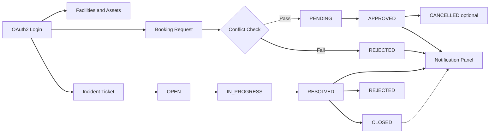

# Smart Campus Operations Hub

<div align="center">
  
</div>

<div align="center">


</div>

## Overview

Smart Campus Operations Hub (IT3030) is a full-stack web application built with Spring Boot and React to streamline university operations through one centralized platform.

The system combines facilities management, booking workflows, incident and maintenance handling, and user communication into a unified digital experience focused on usability, scalability, and maintainability.

## Why This Project

- Replace disconnected manual processes with a single operational hub
- Improve operational visibility across students, staff, technicians, and admins
- Minimize delays through workflow-driven approvals and status tracking
- Support long-term growth with clean architecture and modular design

## Core Modules

### Team Responsibility Mapping

- Member 1: Facilities catalogue + resource management endpoints
- Member 2: Booking workflow + conflict checking
- Member 3: Incident tickets + attachments + technician updates
- Member 4: Notifications + role management + OAuth integration improvements

### 1) Facilities and Assets
- Maintain resources such as lecture halls, labs, and equipment
- Store metadata including capacity, location, and availability
- Provide search and filter capabilities for faster discovery

### 2) Booking Management
- Submit reservation requests with date/time, purpose, and attendees
- Detect booking conflicts and prevent overlapping allocations
- Support approval lifecycle:
  - `PENDING -> APPROVED/REJECTED -> CANCELLED`

### 3) Incident and Maintenance
- Create tickets with category, priority, and description
- Upload up to 3 image attachments per ticket
- Assign technicians and track ownership/responsibility
- Support status lifecycle:
  - `OPEN -> IN_PROGRESS -> RESOLVED -> CLOSED/REJECTED`
- Add comments and resolution notes with proper ownership controls

### 4) Notifications
- Notify users about booking approvals/rejections
- Notify relevant users about ticket status changes
- Notify users when new comments are added
- Provide a web-based notification panel for updates
- Include role-management enhancements and OAuth integration improvements

## Tech Stack

### Backend
- Java 17+
- Spring Boot
- Spring Data JPA (Hibernate)
- Spring Security
- OAuth 2.0 authentication (for example, Google Login)
- MySQL

### Frontend
- React
- Vite
- Axios
- React Hooks + Context API

### Architecture
- Layered backend architecture: Controller -> Service -> Repository
- DTO-based request/response contracts
- Global exception handling and validation-driven API responses
- RESTful API conventions and consistent resource modeling

## Security and Access Control

- OAuth 2.0 authentication for secure sign-in
- Role-based authorization using:
  - `USER`
  - `ADMIN`
  - `TECHNICIAN`
- Ownership-aware access rules for updates, comments, and ticket actions


## End-to-End Workflow




## API Snapshot

Base URL: `http://localhost:8080/api`

| Method | Endpoint | Purpose |
|---|---|---|
| GET | `/facilities` | List/search facilities and assets |
| POST | `/bookings` | Create booking request |
| PUT | `/bookings/{id}/status` | Approve/reject booking |
| POST | `/tickets` | Create a ticket |
| GET | `/tickets` | Get tickets (supports filters) |
| GET | `/tickets/{id}` | Get ticket details |
| PUT | `/tickets/{id}` | Update ticket |
| DELETE | `/tickets/{id}` | Delete ticket |
| POST | `/tickets/{id}/assign` | Assign technician |
| POST | `/tickets/{id}/status` | Update workflow status |
| POST | `/tickets/{id}/comments` | Add comment |
| POST | `/tickets/{id}/attachments` | Upload attachments (max 3 images) |
| GET | `/notifications` | Retrieve user notifications |

## Quality and Delivery Practices

- Request validation for robust API contracts
- Centralized error handling for predictable responses
- Unit/integration testing across core flows
- GitHub Actions workflow for CI checks
- Clean, responsive frontend UX for better usability

## Local Setup

### 1) Backend

```bash
cd backend
mvn clean install
mvn spring-boot:run
```

Backend URL: `http://localhost:8080`

### 2) Frontend

```bash
cd frontend
npm install
npm run dev
```

Frontend URL: `http://localhost:5173`

## Repository Structure

```text
Smart Campus Operations Hub/
├── backend/
│   ├── src/main/java/
│   └── src/main/resources/
├── frontend/
│   ├── src/components/
│   ├── src/pages/
│   ├── src/context/
│   └── src/api/
└── docs/media/
```

## Project Goals

- Usability: clean and intuitive web experience
- Scalability: modular services and maintainable codebase
- Reliability: validation, error handling, and tested workflows
- Maintainability: layered architecture and CI-driven quality checks

## License

This project is for academic purposes.

<div align="center">
  
</div>
